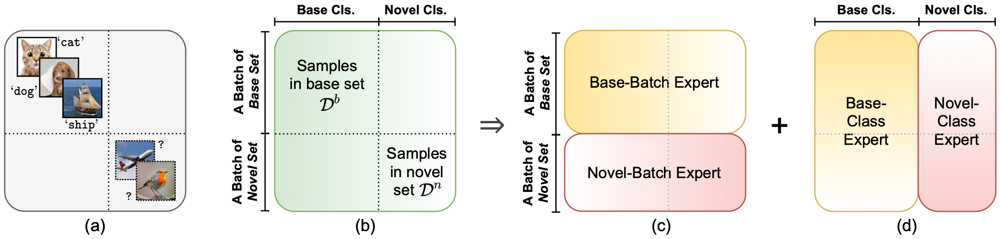

# Compositional Experts (ComEx)
Code for the CVPR 2022 paper:

> **Title:** Divide and Conquer: Compositional Experts for Generalized Novel Class Discovery<br>
> **Authors:** Muli Yang, Yuehua Zhu, Jiaping Yu, Aming Wu, and Cheng Deng<br>
> **Paper:** [CVF Open Access](https://openaccess.thecvf.com/content/CVPR2022/html/Yang_Divide_and_Conquer_Compositional_Experts_for_Generalized_Novel_Class_Discovery_CVPR_2022_paper.html)

## Introduction
**Abstract:** In response to the explosively-increasing requirement of annotated data, Novel Class Discovery (NCD) has emerged as a promising alternative to automatically recognize unknown classes without any annotation. To this end, a model makes use of a base set to learn basic semantic discriminability that can be transferred to recognize novel classes. Most existing works handle the base and novel sets using separate objectives within a two-stage training paradigm. Despite showing competitive performance on novel classes, they fail to generalize to recognizing samples from both base and novel sets. In this paper, we focus on this generalized setting of NCD (GNCD), and propose to divide and conquer it with two groups of Compositional Experts (ComEx). Each group of experts is designed to characterize the whole dataset in a comprehensive yet complementary fashion. With their union, we can solve GNCD in an efficient end-to-end manner. We further look into the drawback in current NCD methods, and propose to strengthen ComEx with global-to-local and local-to-local regularization. ComEx is evaluated on four popular benchmarks, showing clear superiority towards the goal of GNCD.
<br>
<p align="center">
     <br />
    <em>
    The task setting of NCD, and the conceptual motivation of our ComEx.
    </em>
</p>


## Setup
- **Environment:** Our implementation is a fork of [UNO](https://github.com/DonkeyShot21/UNO) v1, so please carefully follow the preparation of the code environment on their [page](https://github.com/DonkeyShot21/UNO#installation).
- **Datasets:** We use CIFAR10/100 and ImageNet datasets in our experiments. The CIFAR datasets can be automatically downloaded to the path specified by `--data_dir` when passing the `--download` argument. For ImageNet please follow the instructions on its [homepage](https://image-net.org/download.php).
- **Checkpoints:** Our ComEx follows the two-stage training paradigm (supervised pretraining + novel class discovery). We directly use the model checkpoints provided in [UNO](https://github.com/DonkeyShot21/UNO#checkpoints) after the supervised pretraining. The checkpoints can be accessed via [Google Drive](https://drive.google.com/drive/folders/1lhoBhT3a--TyvdB2eL-mM2n6I4Kg_qrB?usp=sharing). We also provide our pretrained checkpoint used in our CIFAR100-70 (30 base classes, 70 novel classes) experiment, which can be downloaded via [OneDrive](https://1drv.ms/u/s!AjO77NiOqskYi8M2vjM1oedV0tx95w?e=qNcDQi).
- **Logging:** To use [Wandb](https://wandb.ai/site) for logging, please create an account and specify `--entity YOUR_ENTITY` and `--project YOUR_PROJECT`.
Normally, it requires the Internet accessibility to proceed; otherwise, you can pass `--offline` for logging locally, and the generated files can also be manually uploaded to [Wandb](https://wandb.ai/site) for further analysis.

## Commands
Recall that there is a supervised pretraining stage before the discovery phase. If you would like to train your model from scratch, please run the following lines to get a pretrained checkpoint on base classes. Note that your checkpoint will be located in the `checkpoints` folder by default.
```
CUDA_VISIBLE_DEVICES=0 python main_pretrain.py \
 --dataset CIFAR10 \
 --data_dir PATH/TO/DATASET \
 --gpus 1 \
 --precision 16 \
 --num_base_classes 5 \
 --num_novel_classes 5 \
 --comment 5_5
```

After that, you can start novel class discovery using the pretrained checkpoint (or directly using the above provided checkpoint) by specifying `--pretrained` with your checkpoint path:
```
CUDA_VISIBLE_DEVICES=0 python main_discover.py \
 --dataset CIFAR10 \
 --data_dir PATH/TO/DATASET \
 --gpus 1 \
 --precision 16 \
 --num_base_classes 5 \
 --num_novel_classes 5 \
 --queue_size 500 \
 --sharp 0.5 \
 --batch_head \
 --batch_head_multi_novel \
 --batch_head_reg 1.0 \
 --pretrained PATH/TO/CHECKPOINTS/pretrain-resnet18-CIFAR10.cp \
 --comment 5_5
```

### Tips for running on different datasets
- Specify `--dataset` with `CIFAR10`, `CIFAR100` or `ImageNet`.
- Specify `--data_dir` with the path where you store the dataset.
- Make sure `--num_base_classes` and `--num_novel_classes` accord with the setting you want.
- Modify `--comment` so that you can easily find the [Wandb](https://wandb.ai/site) logs.

When running discovery:
- Specify `--pretrained` with the path to the checkpoint you would like to use.


For running on ImageNet, please use the following commands:

```
CUDA_VISIBLE_DEVICES=0 python main_pretrain.py \
 --dataset ImageNet \
 --data_dir PATH/TO/IMAGENET \
 --gpus 1 \
 --precision 16 \
 --max_epochs 100 \
 --warmup_epochs 5 \
 --num_base_classes 882 \
 --num_novel_classes 30 \
 --comment 882_30
```

```
CUDA_VISIBLE_DEVICES=0 python main_discover.py \
 --dataset ImageNet \
 --data_dir PATH/TO/IMAGENET \
 --imagenet_split A \
 --gpus 1 \
 --precision 16  \
 --max_epochs 60 \
 --warmup_epochs 5 \
 --num_base_classes 882 \
 --num_novel_classes 30 \
 --queue_size 500 \
 --sharp 0.5 \
 --pretrained PATH/TO/CHECKPOINTS/pretrain-resnet18-ImageNet.cp \
 --comment 882_30-A
```

- Specify `--imagenet_split` with `A`, `B` or `C`.

## TODO


## Acknowledgements
Our work is inspired from many recent efforts in various fields.
They are
- [UNO](https://www.google.com.hk/search?client=safari&rls=en&q=uno+novel+class+discovery&ie=UTF-8&oe=UTF-8)
- [SwAV](https://github.com/facebookresearch/swav)
- [PAWS](https://github.com/facebookresearch/suncet)
- [CoMatch](https://github.com/salesforce/CoMatch)
- [ACE](https://github.com/jrcai/ACE)
- [TADE](https://github.com/Vanint/TADE-AgnosticLT)
- [MSF](https://github.com/UMBCvision/MSF)
- [NCL](https://github.com/zhunzhong07/NCL)
- [SCAN](https://github.com/wvangansbeke/Unsupervised-Classification)


Many thanks for their great work!

## Citations
If you find our work helpful, please consider citing our [paper](https://openaccess.thecvf.com/content/CVPR2022/html/Yang_Divide_and_Conquer_Compositional_Experts_for_Generalized_Novel_Class_Discovery_CVPR_2022_paper.html):
```
@InProceedings{yang2022divide,
    author    = {Yang, Muli and Zhu, Yuehua and Yu, Jiaping and Wu, Aming and Deng, Cheng},
    title     = {Divide and Conquer: Compositional Experts for Generalized Novel Class Discovery},
    booktitle = {Proceedings of the IEEE/CVF Conference on Computer Vision and Pattern Recognition (CVPR)},
    month     = {June},
    year      = {2022},
    pages     = {14268-14277}
}
```
If you use our code, please also consider citing the [paper](https://openaccess.thecvf.com/content/ICCV2021/html/Fini_A_Unified_Objective_for_Novel_Class_Discovery_ICCV_2021_paper.html) of [UNO](https://github.com/DonkeyShot21/UNO):
```
@InProceedings{Fini_2021_ICCV,
    author    = {Fini, Enrico and Sangineto, Enver and Lathuili\`ere, St\'ephane and Zhong, Zhun and Nabi, Moin and Ricci, Elisa},
    title     = {A Unified Objective for Novel Class Discovery},
    booktitle = {Proceedings of the IEEE/CVF International Conference on Computer Vision (ICCV)},
    month     = {October},
    year      = {2021},
    pages     = {9284-9292}
}
```